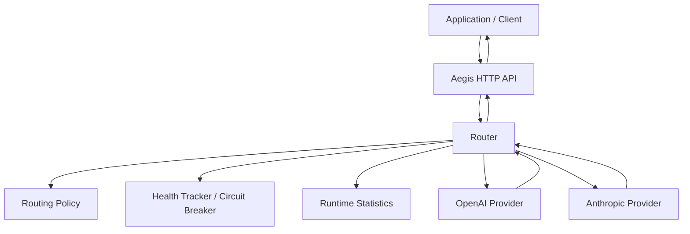

# Aegis

Aegis is a high-performance AI inference gateway written in Go that provides a unified API for routing requests across multiple model providers.

It currently supports OpenAI and Anthropic with configurable routing policies, retries, timeouts, automatic failover, circuit breaking, streaming, provider health tracking, structured logging, and runtime metrics.

The goal of Aegis is to reduce application-level dependence on individual AI providers while centralizing the reliability and routing logic needed for production inference systems.

---

## Why Aegis?

Applications that integrate directly with AI providers often need to independently handle:

- Provider-specific APIs
- Model selection
- Provider outages
- Retries
- Request timeouts
- Failover
- Streaming
- Provider health
- Error handling
- Operational metrics

Aegis moves these responsibilities behind one gateway.

```text
Application
    |
    v
  Aegis
    |
    +------> OpenAI
    |
    +------> Anthropic
```

Instead of each application implementing provider-specific reliability logic, applications send requests to Aegis and let the gateway control routing and failure handling.

---

# Features

## Multi-Provider Routing

Aegis currently supports:

- OpenAI
- Anthropic
- Mock provider for testing and benchmarking

Requests can be routed explicitly using:

```text
openai/gpt-5.4-mini
anthropic/claude-sonnet-4-6
```

Aegis also supports configurable aliases such as:

```text
fast
quality
```

These aliases are currently routing configuration labels and should not be interpreted as benchmark-proven model quality or latency rankings.

---

## Pluggable Routing Policies

Routing behavior is separated from provider implementations using a routing policy interface.

Current routing policies include:

- Prefix-based routing
- Static routing
- Alias-based routing
- Alias routing with fallback providers

This allows routing logic to evolve without coupling it directly to individual AI providers.

---

## Automatic Provider Failover

Routes can define fallback providers.

Example:

```text
Primary Provider
      |
      | failure
      v
Fallback Provider
```

A request can therefore follow:

```text
OpenAI
   |
 failure
   |
   v
Anthropic
```

If the primary provider fails, Aegis can automatically attempt a configured fallback provider.

---

## Retries

Provider requests support retries with configurable backoff.

Example request flow:

```text
Request
   |
   v
Primary attempt
   |
 failure
   |
   v
Retry
   |
 failure
   |
   v
Fallback provider
```

Retries operate at the provider-attempt level.

---

## Provider Timeouts

Non-streaming provider calls are protected by per-attempt timeouts.

If a provider exceeds its timeout, the request can be retried or routed to a configured fallback provider.

This prevents a slow or unavailable provider from indefinitely blocking gateway requests.

---

## Circuit Breaker

Aegis tracks consecutive provider failures.

When a provider reaches the configured failure threshold, its circuit opens.

```text
Healthy
   |
 failures
   v
Open
   |
 cooldown
   v
Half-open probe
   |
   +---- success ----> Healthy
   |
   +---- failure ----> Open
```

While a circuit is open, Aegis skips the unhealthy provider instead of repeatedly sending traffic to it.

After the cooldown period, Aegis allows a recovery probe.

Only one recovery probe is allowed through at a time, preventing large numbers of requests from simultaneously hitting a recovering provider.

---

## Safe Streaming Failover

Aegis supports Server-Sent Events (SSE) streaming for:

- OpenAI
- Anthropic

Streaming failover follows an important safety rule:

```text
Failure before first output
        |
        v
Fallback is safe
```

but:

```text
Failure after output starts
        |
        v
Do not switch providers
```

Once a provider has already emitted output to the client, switching to another model could produce an inconsistent or corrupted response.

Aegis therefore only performs streaming failover before the first output chunk has been emitted.

---

## Runtime Provider Metrics

Aegis tracks provider-level runtime statistics including:

- Provider attempts
- Errors
- Average latency
- Health state

Metrics are exposed through:

```text
GET /metrics
```

Example:

```bash
curl http://localhost:8080/metrics
```

Example response:

```json
{
  "providers": {
    "anthropic": {
      "requests": 2,
      "errors": 0,
      "average_latency_ms": 1703.374166,
      "healthy": true
    },
    "openai": {
      "requests": 0,
      "errors": 0,
      "average_latency_ms": 0,
      "healthy": true
    }
  }
}
```

Metrics are currently stored in memory and reset when the Aegis process restarts.

The `requests` field currently represents provider attempts, so retries contribute additional attempts.

---

## Structured Logging

Aegis uses structured logging for operational events.

Provider errors are logged internally while clients receive safe generic responses.

For example, an upstream failure may be logged internally while the client receives:

```json
{
  "error": "provider request failed"
}
```

This prevents raw provider error details from being exposed through the public API.

Aegis does not intentionally log prompt contents or API keys.

---

## Graceful Shutdown

Aegis listens for operating-system termination signals and performs graceful HTTP shutdown.

This allows active requests to finish before the process exits.

---

# Architecture



---

## Request Flow

```text
Client
  |
  v
HTTP API
  |
  v
Routing Policy
  |
  v
Provider Health Check
  |
  v
Selected Provider
  |
  +---- success --------------------+
  |                                 |
  +---- retry ----------------------+--> Response
  |                                 |
  +---- fallback -------------------+
```

Aegis separates:

```text
API handling
routing policy
provider execution
health tracking
statistics
provider integrations
```

so that each part can evolve independently.

---

# Project Structure

```text
aegis/
├── cmd/
│   ├── aegis/
│   │   └── main.go
│   │
│   ├── benchserver/
│   │   └── main.go
│   │
│   └── loadtest/
│       └── main.go
│
├── internal/
│   ├── api/
│   │   ├── server.go
│   │   ├── server_test.go
│   │   └── benchmark_test.go
│   │
│   ├── config/
│   │   └── config.go
│   │
│   ├── providers/
│   │   ├── provider.go
│   │   ├── types.go
│   │   │
│   │   ├── anthropic/
│   │   │   ├── anthropic.go
│   │   │   └── anthropic_test.go
│   │   │
│   │   ├── mock/
│   │   │   ├── mock.go
│   │   │   └── mock_test.go
│   │   │
│   │   └── openai/
│   │       ├── openai.go
│   │       └── openai_test.go
│   │
│   ├── router/
│   │   ├── router.go
│   │   ├── router_test.go
│   │   ├── policy.go
│   │   ├── policy_test.go
│   │   ├── stats.go
│   │   ├── stats_test.go
│   │   ├── health.go
│   │   ├── health_test.go
│   │   ├── reliability_test.go
│   │   └── benchmark_test.go
│   │
│   └── telemetry/
│       └── logger.go
│
├── .github/
│   └── workflows/
│       └── ci.yml
│
├── .gitignore
├── Dockerfile
├── go.mod
└── README.md
```

---

# Requirements

- Go 1.27+
- OpenAI API key for OpenAI requests
- Anthropic API key for Anthropic requests
- Docker optional

---

# Configuration

Aegis reads its configuration from environment variables.

## Server Port

```bash
export AEGIS_PORT=8080
```

If no port is provided, Aegis defaults to:

```text
8080
```

---

## OpenAI

```bash
export OPENAI_API_KEY="your-key"
```

---

## Anthropic

```bash
export ANTHROPIC_API_KEY="your-key"
```

Do not commit API keys to the repository.

Environment files are excluded through `.gitignore`.

---

# Running Aegis

Clone the repository:

```bash
git clone https://github.com/Yxp23/Aegis.git
cd Aegis
```

Run the server:

```bash
go run ./cmd/aegis
```

By default Aegis listens on:

```text
http://localhost:8080
```

---

# Health Check

```bash
curl http://localhost:8080/health
```

Response:

```json
{
  "status": "ok"
}
```

---

# Chat API

Aegis exposes:

```text
POST /v1/chat/completions
```

---

## OpenAI Example

```bash
curl -X POST http://localhost:8080/v1/chat/completions \
  -H "Content-Type: application/json" \
  -d '{
    "model": "openai/gpt-5.4-mini",
    "messages": [
      {
        "role": "user",
        "content": "Say hello from Aegis"
      }
    ]
  }'
```

Example response:

```json
{
  "content": "Hello from Aegis!"
}
```

---

## Anthropic Example

```bash
curl -X POST http://localhost:8080/v1/chat/completions \
  -H "Content-Type: application/json" \
  -d '{
    "model": "anthropic/claude-sonnet-4-6",
    "messages": [
      {
        "role": "user",
        "content": "Say hello from Aegis"
      }
    ]
  }'
```

---

# Streaming

Streaming can be enabled using:

```json
{
  "stream": true
}
```

Example:

```bash
curl -N -X POST http://localhost:8080/v1/chat/completions \
  -H "Content-Type: application/json" \
  -d '{
    "model": "openai/gpt-5.4-mini",
    "stream": true,
    "messages": [
      {
        "role": "user",
        "content": "Explain an API gateway in one sentence."
      }
    ]
  }'
```

Aegis responds using Server-Sent Events:

```text
data: {"content":"An"}

data: {"content":" API"}

data: {"content":" gateway"}

data: {"content":" ..."}

data: [DONE]
```

Streaming is also supported through the Anthropic provider.

---

# Metrics

Retrieve runtime metrics:

```bash
curl http://localhost:8080/metrics
```

Metrics currently expose:

```text
requests
errors
average_latency_ms
healthy
```

Example:

```json
{
  "providers": {
    "anthropic": {
      "requests": 2,
      "errors": 0,
      "average_latency_ms": 1703.374166,
      "healthy": true
    },
    "openai": {
      "requests": 0,
      "errors": 0,
      "average_latency_ms": 0,
      "healthy": true
    }
  }
}
```

Metrics currently exist per Aegis process and are not persisted across restarts.

---

# Reliability Behavior

Aegis combines multiple reliability mechanisms.

A failure sequence can look like:

```text
Primary provider
      |
      v
Request timeout
      |
      v
Retry
      |
      v
Failure
      |
      v
Circuit breaker records failure
      |
      v
Fallback provider
      |
      v
Success
```

After enough consecutive failures:

```text
Primary provider
      |
      v
Circuit OPEN
      |
      v
Primary skipped
      |
      v
Fallback used immediately
```

After the circuit-breaker cooldown:

```text
Circuit OPEN
      |
      v
Cooldown expires
      |
      v
Single recovery probe
      |
      +---- success ---> Healthy
      |
      +---- failure ---> Open again
```

---

# Reliability Testing

Aegis includes tests covering:

- Provider routing
- Unknown providers
- Routing policy injection
- Alias routing
- Provider failure statistics
- Request timeouts
- Retries
- Retry backoff
- Provider failover
- Circuit breaker activation
- Circuit breaker cooldown
- Half-open recovery
- Single concurrent recovery probe
- Provider health tracking
- Runtime metrics
- Streaming
- Streaming provider integration
- Streaming failover before first output
- Streaming failure after output starts
- API validation
- JSON error responses
- Race conditions

A combined reliability test verifies the full failure chain:

```text
primary request
      |
      v
timeout
      |
      v
retry
      |
      v
timeout
      |
      v
circuit opens
      |
      v
fallback succeeds
      |
      v
next request skips unhealthy primary
```

---

# Testing

Run the complete test suite:

```bash
go test ./...
```

Run with Go's race detector:

```bash
go test -race ./...
```

The race detector is used to validate concurrent routing, metrics, health tracking, and circuit-breaker behavior.

---

# Router Microbenchmarks

Run:

```bash
go test -bench=. -benchmem ./internal/router
```

Observed on an Apple M2:

```text
BenchmarkRouterChat-8
679.3 ns/op
320 B/op
6 allocs/op

BenchmarkRouterChatParallel-8
701.6 ns/op
320 B/op
6 allocs/op
```

These measurements use an in-process mock provider.

They measure routing overhead and should not be interpreted as OpenAI or Anthropic inference latency.

---

# HTTP Gateway Benchmarks

The complete local HTTP path was also benchmarked.

Measured path:

```text
HTTP request
     |
     v
JSON decoding
     |
     v
API handler
     |
     v
Router
     |
     v
Health check
     |
     v
Statistics
     |
     v
Mock provider
     |
     v
JSON response
```

Observed on an Apple M2:

```text
BenchmarkChatHTTP-8
56.467 µs/op

BenchmarkChatHTTPParallel-8
22.072 µs/op
```

The parallel Go benchmark measures aggregate concurrent execution and should not be interpreted as individual request latency.

---

# Load Testing

Aegis includes two dedicated benchmarking tools:

```text
cmd/benchserver
cmd/loadtest
```

The benchmark server runs Aegis with the local mock provider.

The load generator runs separately and sends real HTTP requests over localhost TCP.

This prevents the benchmark server and load generator from sharing the same Go process.

---

## Build the Benchmark Server

```bash
go build -o /tmp/aegis-benchserver ./cmd/benchserver
```

Start it:

```bash
/tmp/aegis-benchserver
```

The benchmark server listens on:

```text
http://localhost:9090
```

---

## Build the Load Generator

```bash
go build -o /tmp/aegis-loadtest ./cmd/loadtest
```

Example:

```bash
/tmp/aegis-loadtest \
  -requests 50000 \
  -concurrency 50 \
  -url http://localhost:9090
```

---

# Load Test Results

Benchmark environment:

```text
Hardware:      Apple M2
OS:            macOS
Architecture:  darwin/arm64

Requests:      50,000 per trial
Concurrency:   50
Trials:        5
Provider:      Local mock provider

Server:        Separate Aegis process
Load client:   Separate load-generator process
Transport:     localhost TCP
```

A warm-up run was performed before the measured trials.

Across five measured trials:

```text
Total requests: 250,000
Failures:       0
```

Individual throughput results:

```text
Trial 1: 63,968.89 req/s
Trial 2: 63,493.74 req/s
Trial 3: 52,558.80 req/s
Trial 4: 46,821.61 req/s
Trial 5: 48,044.31 req/s
```

Median throughput:

```text
52,558.80 requests/second
```

Median latency values across the measured runs:

| Metric | Result |
|---|---:|
| Throughput | 52,558.80 req/s |
| P50 latency | 729.875 µs |
| P95 latency | 2.414 ms |
| P99 latency | 3.733 ms |
| Failures | 0 / 250,000 |

The median is reported rather than selecting the highest observed result.

---

## Benchmark Scope

These benchmarks measure **Aegis gateway overhead**, not AI inference performance.

The benchmark intentionally uses a local mock provider.

This prevents the results from being dominated by:

- Internet latency
- OpenAI latency
- Anthropic latency
- Model inference time
- Provider-side queueing
- External rate limits

The benchmark therefore primarily measures:

```text
HTTP handling
JSON decoding
routing policy selection
provider lookup
health checks
context creation
circuit-breaker state
statistics recording
JSON encoding
HTTP response handling
```

Real provider requests will naturally have significantly higher latency because model inference and external network communication dominate total request time.

---

# Docker

Build the container:

```bash
docker build -t aegis .
```

Run Aegis:

```bash
docker run \
  -p 8080:8080 \
  -e OPENAI_API_KEY="$OPENAI_API_KEY" \
  -e ANTHROPIC_API_KEY="$ANTHROPIC_API_KEY" \
  aegis
```

Verify:

```bash
curl http://localhost:8080/health
```

---

# Continuous Integration

Aegis uses GitHub Actions for automated validation.

The CI workflow runs the Go test suite and build validation on the repository.

This helps ensure that changes continue to compile and pass automated tests.

---

# Current v0.1 Scope

Aegis v0.1 focuses on establishing the core inference gateway and reliability layer.

Implemented:

- Go HTTP gateway
- Provider abstraction
- OpenAI integration
- Anthropic integration
- Mock provider
- Multi-provider routing
- Prefix routing
- Static routing
- Alias routing
- Fallback routes
- Provider retries
- Retry backoff
- Provider timeouts
- Circuit breaker
- Circuit-breaker cooldown
- Half-open recovery probes
- Concurrent recovery protection
- Runtime provider statistics
- Provider health tracking
- Metrics endpoint
- OpenAI streaming
- Anthropic streaming
- SSE API streaming
- Safe streaming failover
- Structured logging
- Graceful shutdown
- Environment configuration
- Docker support
- GitHub Actions CI
- Unit tests
- Integration tests
- Reliability-chain testing
- Go race-detector validation
- Router microbenchmarks
- HTTP benchmarks
- Separate-process load testing

---

# Roadmap

Aegis v0.1 establishes the foundation.

Future versions are planned to explore the following areas.

---

## Intelligent Routing

- Cost-aware routing
- Latency-aware routing
- Quality-aware routing
- Workload-specific model selection
- Dynamic routing policies
- Learned routing
- Shadow evaluation
- Canary routing
- Model evaluation pipelines

---

## Reliability

- Error classification for retry decisions
- Retry only for transient failures
- Provider-specific retry policies
- Streaming first-token timeout
- Streaming idle timeout
- Distributed circuit-breaker state
- Advanced backoff strategies

---

## Authentication and Rate Limiting

- Gateway API keys
- Authentication
- Per-client limits
- Request quotas
- Token quotas
- Rate limiting

---

## Persistent Infrastructure

- Redis
- PostgreSQL
- Persistent routing configuration
- Persistent usage metrics
- Distributed provider health state

---

## Observability

- Prometheus
- OpenTelemetry
- Distributed tracing
- Provider dashboards
- Request dashboards
- Latency percentiles
- Error-rate dashboards

---

## Cloud Infrastructure

Planned AWS deployment work includes:

- Amazon ECS
- Application Load Balancer
- Amazon RDS
- Amazon ElastiCache
- AWS Secrets Manager
- Amazon CloudWatch
- Autoscaling
- Terraform
- Production load testing

---

## Additional Providers and Workloads

Possible future support includes:

- Additional inference providers
- Multimodal workloads
- Agentic workloads
- Tool-calling workloads
- Evaluation-driven model selection

---

# Design Principles

Aegis is being developed around several core principles.

## Provider Independence

Applications should not need to implement provider-specific reliability and routing logic.

---

## Safe Failure Handling

Fallback should only occur when switching providers cannot corrupt an already-started response.

---

## Observable Behavior

Provider health, failures, latency, and routing behavior should be measurable.

---

## Concurrency Safety

Shared router, health, and statistics state must remain correct under concurrent traffic.

---

## Measured Performance

Performance claims should come from reproducible benchmarks rather than assumptions.

---

## Separation of Concerns

Routing, providers, health tracking, statistics, API handling, and telemetry should remain independently testable and replaceable.

---

# Status

Aegis is currently an early-stage open-source inference gateway.

The v0.1 release establishes the core:

```text
gateway
routing
providers
streaming
retries
timeouts
failover
circuit breaking
health tracking
metrics
testing
benchmarking
```

Future releases will expand Aegis toward distributed infrastructure, persistent state, advanced observability, cloud deployment, and intelligent cost/quality/latency-aware routing.